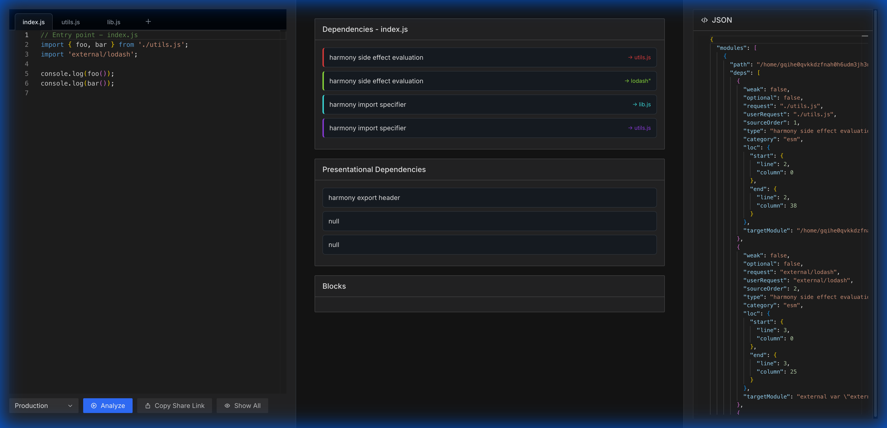

# Webpack Dependencies Visualizer

A web-based tool to visualize and explore webpack module dependencies in real-time. Built with React, Monaco Editor, and WebContainer.



## Setup

Install dependencies:

```bash
pnpm install
```

## Development

Start the development server:

```bash
pnpm dev
```

## Production

Build for production:

```bash
pnpm build
```

Preview the production build:

```bash
pnpm preview
```

## Usage

1. Open the application in your browser.
2. Edit the source code in the left panel.
3. Click **Analyze** to compile and visualize dependencies.
4. Hover over dependencies to see connection lines.
5. Click on a dependency to jump to its JSON representation.

## License

MIT
